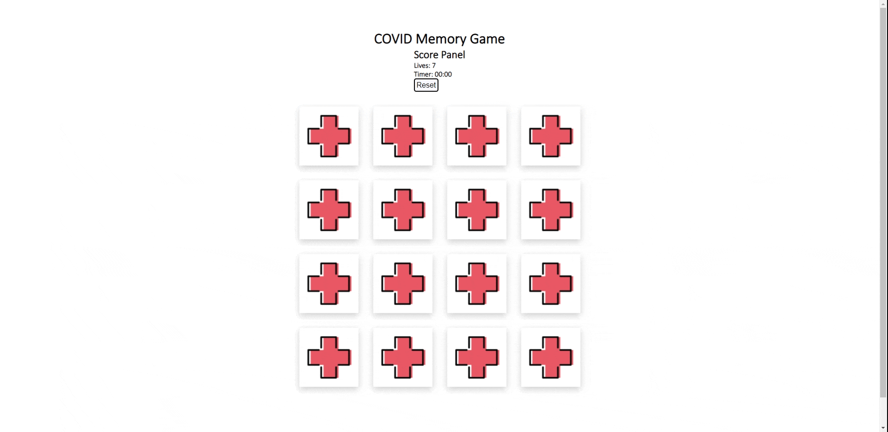

# COVID Memory Game

## Story
My task was to create a game in the browser. 
I've chosen on a vanilla JS to use just the basics of Javascript.
I try to create something fun, creative, and motivating game during those 
really hard days of Covid-19.

## During work on this project I have learned:
- Finding DOM elements in the document tree.
- Manipulate the DOM using JavaScript.
- Handle user interactions with JavaScript event handlers.
- Use HTML data attributes.
- Use CSS styling.

## ⚡ LET'S PLAY ⚡
### https://iurii-dziubiak.github.io/covid-memo-game/

## 🔥 SKILLS 🔥

